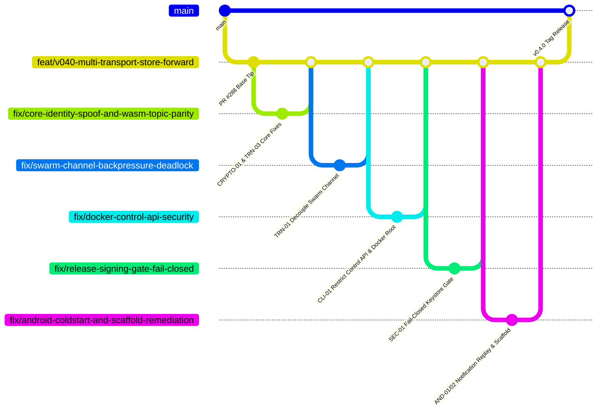

# SCMessenger Adversarial Shadow Audit: Pre-v0.4.0 / v0.5.0 Architecture & Security Review

**Date:** 2026-09-16  
**Auditor Seat:** Shadow Adversarial Auditor (Impartial Orchestration)  
**Target Repository:** `Sovereign-Communication/SCMessenger`  
**Target Branch:** `feat/v040-multi-transport-store-forward` (PR #288)  
**Evidence Baseline:** Commit `ddca1340` (and active remote PR stack #288, #289, #290, #291, #292, #293, #294, #295, Issue #155 / PR #156)

---

## 1. Executive Summary & Release Gating Verdict

### **VERDICT: HALT v0.4.0 TAG (CRITICAL RELEASE BLOCKERS DETECTED)**

The branch tip is **NOT ready** for the `v0.4.0` release tag. While previous internal audits (e.g. `TAG_READINESS_EVIDENCE_2026-09-15.md`) reported passing conditions on synthetic test harnesses, adversarial examination across Transport, IronCore, CLI, Android, and CI/CD reveals seven (7) Critical and seven (7) High severity findings that make an immediate release tag hazardous to security, stability, and availability.

### Top Release Blockers:
1. **Cryptographic Identity Spoofing in Core Message Dispatch (CRYPTO-01)**:
   - *Mechanism*: In `core/src/iron_core.rs:3848-3855`, when `receive_message()` notifies `CoreDelegate::on_message_received`, it discards the verified `canonical_peer_id` and authenticated `sender_public_key_hex`. Instead, it passes the unauthenticated, attacker-controlled plaintext field `message.sender_id` for **BOTH** parameters. Any peer can place a spoofed identity or victim public key inside `message.sender_id`, completely spoofing senders in UI notifications and conversation views.
2. **Windows Node Silent Wedge Concurrency Deadlock (TRN-01)**:
   - *Mechanism*: The libp2p swarm event loop is a single-threaded Tokio select task. Inbound events emit via `event_tx.send(SwarmEvent2::...).await` into a bounded channel (`capacity = 16` in `cli/src/main.rs:4446`). When discovery bursts occur, the buffer fills. If `cli/src/main.rs` is awaiting a reply from the swarm via `command_tx.send(...)` or `reply_rx.recv()`, an unrecoverable cyclic deadlock freezes the event loop. The watchdog merely calls `exit(1)`, permanently killing standalone nodes.
3. **WASM Swarm Never Subscribes to Own Topic (100% Inbound Message Loss) (TRN-03)**:
   - *Mechanism*: In `core/src/transport/swarm.rs:8119-8123`, `start_swarm_wasm` was omitted from commit `6acaa231`. WASM swarms never subscribe to `/scmessenger/peer/<own_hex>/v1`. Senders observe successful submission, but WASM nodes silently drop 100% of all inbound direct messages.
4. **Unauthenticated Custody Ingestion & Infinite Retention (TRN-04)**:
   - *Mechanism*: In `core/src/store/relay_custody.rs:587-688`, `accept_custody()` accepts arbitrary custody messages for unknown recipients without sender authentication or proof. `CustodyMessage` has zero TTL and infinite retention. Combined with the Windows storage quota bypass (TRN-02), attackers can permanently exhaust relay host disks.
5. **Unauthenticated Control API on `0.0.0.0:9876` in Docker/AWS Relay (CLI-01)**:
   - *Mechanism*: `docker/entrypoint.sh:76` unconditionally binds Axum HTTP control API to `0.0.0.0:9876` with `allow_origin(Any)` and no authentication, exposing `POST /api/shutdown` (kills node), `POST /api/send` (forges cryptographically signed messages), and `GET /api/history` (dumps plaintext chats).
6. **Release Pipeline Silent Fallback to Unsigned Debug APK (SEC-01)**:
   - *Mechanism*: In `.github/workflows/release.yml`, signing steps run conditionally under `if: ${{ env.HAS_KEYSTORE == 'true' }}`, but `assembleDebug` runs unconditionally. If keystore secrets are missing or misnamed, the release pipeline publishes an unsigned debug APK (`CN=Android Debug`) on GitHub Releases with zero `.aab` bundles.
7. **Android Cold-Start Notification Loss & Nested Scaffold Crashes (AND-01, AND-02)**:
   - *Mechanism*: `NotificationHelper.kt` permanently suppresses messages received before asynchronous DataStore hydration completes. Nested `Scaffold` composables in `MeshApp.kt` corrupt `SlotTable` gap arithmetic upon back-stack disposal (`SlotTableKt.dataAnchor`), and `MeshApplication.kt` swallows the crash, causing zombie ANRs.

---

## 2. Comprehensive Findings Matrix

| ID | Domain | Severity | Title | Affected Files / Lines |
|---|---|---|---|---|
| **CRYPTO-01** | Core / Crypto | **CRITICAL** | Cryptographic Identity Spoofing: Unauthenticated Plaintext Sender Passed to Delegate | `core/src/iron_core.rs:3848-3855`, `api.udl:122` |
| **TRN-01** | Transport | **CRITICAL** | Swarm Bounded Event Channel Backpressure Deadlock | `core/src/transport/swarm.rs:4511`, `cli/src/main.rs:4446` |
| **TRN-02** | Transport | **HIGH** | Windows Storage Pressure Probe Bypassed (Disk DoS) | `core/src/store/relay_custody.rs:958, 1875-1878` |
| **TRN-03** | Transport / WASM | **CRITICAL** | Parity Defect: WASM Swarm Never Subscribes to Own Topic (100% Inbound Message Loss) | `core/src/transport/swarm.rs:8119-8123, 9043` |
| **TRN-04** | Store / Custody | **CRITICAL** | Unauthenticated Custody Ingestion & Infinite Retention in Cooperative Mesh | `core/src/store/relay_custody.rs:587-688, 714` |
| **TRN-05** | Transport | **MAJOR** | False-Positive Ghost Classification Dropping Live / Cloud Relay Connections | `core/src/transport/swarm.rs:3324-3334, 5513` |
| **TRN-06** | Store / I/O | **MAJOR** | O(N) Database Table Scan & Deserialization on Every Custody Write | `core/src/store/relay_custody.rs:1002, 1070-1076` |
| **TRN-07** | Transport | **HIGH** | Global 200 msg/hr Relay Budget Enables Trivial Network-Wide DoS | `core/src/transport/swarm.rs:4923-4927, 4963` |
| **TRN-08** | Transport | **HIGH** | Mobile Handover Starvation: 4-Connection Cap Wedged by Half-Open Sockets | `core/src/transport/behaviour.rs:524-533` |
| **CLI-01** | CLI / Daemon | **CRITICAL** | Unauthenticated Control API on `0.0.0.0:9876` in Docker | `docker/entrypoint.sh:76`, `cli/src/api.rs:1425-1431` |
| **CLI-02** | CLI / Daemon | **HIGH** | Watchdog `exit(1)` Without Service Supervisor in Binaries | `cli/src/bin/heartbeat-probe.rs:114`, `scripts/run_node_supervised.ps1` |
| **AND-01** | Android / Notif | **CRITICAL** | Cold-Start Notification Permanent Suppression Race | `NotificationHelper.kt:101`, `MeshForegroundService.kt:111-141` |
| **AND-02** | Android / UI | **CRITICAL** | Nested-Scaffold Subcomposition Crash & Fake Exception Recovery | `MeshApp.kt:138`, `PeerListScreen.kt:56`, `MeshApplication.kt:112` |
| **AND-03** | Android / Trans | **HIGH** | SubnetProbe Port 9001 Omission & Continuous Scan Drain | `SubnetProbe.kt:496, 76-89` |
| **AND-04** | Android / Net | **HIGH** | LAN mDNS Unauthenticated Dial Injection (SSRF) & Duplicate Storm | `MdnsServiceDiscovery.kt:327`, `TransportManager.kt:166` |
| **AND-05** | Android / FFI | **HIGH** | O(N*M) Synchronous FFI & BigInteger Math Blocking UI Thread | `DashboardViewModel.kt:340, 714` |
| **AND-06** | Android / Core | **HIGH** | Open P1 Doctrine Violation: Kotlin BigInteger Ed25519 Math | `PeerIdValidator.kt:112`, `DashboardViewModel.kt:41` |
| **SEC-01** | Security / CI | **CRITICAL** | Release Workflow Silent Degradation to Unsigned Debug APK | `.github/workflows/release.yml:126-291, 404-453` |
| **SEC-02** | Security / CI | **HIGH** | Active Keystore Alias Mismatch (`SCMESSENGER_KEY_ALIAS`) | `.github/workflows/release.yml:208-212`, Rehearsal 34996353889 |
| **SEC-03** | Supply Chain | **HIGH** | Unmaintained `sled` Engine & Stale `deny.toml` Waivers | `Cargo.lock`, `deny.toml:8-31`, `core/Cargo.toml:52` |
| **GOV-01** | Governance | **HIGH** | TOCTOU File-Lock Race & Duplicate Ledger Append Lockup | `scripts/bod_governance.py:513-551, 585-602` |

---

## 3. Detailed Technical Analyses & Proofs

### [CRYPTO-01] CRITICAL: Cryptographic Identity Spoofing in Core Message Dispatch
- **File / Lines**: `core/src/iron_core.rs:3848-3855`, `core/src/api.udl:122`
- **Failure Mechanism**: In `receive_message()`, the envelope's cryptographic signature is authenticated, producing `sender_pubkey` (`sender_public_key_hex`) and `canonical_peer_id`. However, when dispatching to the application delegate:
  ```rust
  if let Some(delegate) = self.delegate.read().as_ref() {
      delegate.on_message_received(
          message.sender_id.clone(), // PARAMETER 1: sender_id
          message.sender_id.clone(), // PARAMETER 2: sender_public_key_hex (BUG!)
          message.id.clone(),
          message.timestamp,
          message.payload.clone(),
      );
  }
  ```
  `message.sender_id` is an unauthenticated plaintext string inside the decrypted message payload. Any attacker with an active keypair can encrypt an envelope containing a victim's or operator's identity string in `message.sender_id`. Downstream Android, iOS, and CLI delegates attribute the message directly to the spoofed sender, bypassing cryptographic identity binding in all client interfaces.
- **Remediation**: Pass verified `canonical_peer_id` and `sender_public_key_hex` to `on_message_received`.

### [TRN-03] CRITICAL: WASM Swarm Never Subscribes to Own Topic (100% Inbound Message Loss)
- **File / Lines**: `core/src/transport/swarm.rs:8119-8123`, `9043-9056`
- **Failure Mechanism**: Commit `6acaa231` fixed own-topic subscription on native platforms, but `start_swarm_wasm` was omitted:
  ```rust
  let mut subscribed_topics: HashSet<String> = HashSet::new();
  subscribed_topics.insert("sc-lobby".to_string());
  subscribed_topics.insert("sc-mesh".to_string());
  subscribed_topics.insert(DELIVERY_CONVERGENCE_TOPIC.to_string());
  // MISSING: Does not derive own_peer_key_hex and does not subscribe to own topic!
  ```
  Because Gossipsub `publish` succeeds even with zero subscribers, senders observe successful delivery, but WASM nodes silently drop 100% of inbound direct messages. Furthermore, WASM's `Subscribed` event handler lacks the `is_ghost_peer_topic` guard.
- **Remediation**: Derive `own_peer_key_hex` and subscribe to `/scmessenger/peer/<own_hex>/v1` in `start_swarm_wasm`.

### [TRN-04] CRITICAL: Unauthenticated Custody Ingestion & Infinite Retention in Cooperative Mesh
- **File / Lines**: `core/src/store/relay_custody.rs:587-688, 714-723`
- **Failure Mechanism**: `accept_custody()` accepts relay envelopes for arbitrary destinations without sender authentication. The per-destination quota (`MAX_PENDING_PER_DESTINATION = 10,000`) is keyed on destination ID; an attacker generating 1,000 distinct destination IDs can inject 10,000 messages each (640 GB). In addition, `CustodyMessage` has no `ttl` field, retaining dead messages indefinitely.
- **Remediation**: Implement a global custody cap (`MAX_TOTAL_PENDING_CUSTODY = 5,000`), add a default 7-day TTL expiration, and prune expired envelopes periodically.

---

## 4. Remediation Merge Train Roadmap

All remediation work is tracked via child PR branches targeting `feat/v040-multi-transport-store-forward` (PR #288):



### Active Tracking PRs:
- **[#296](https://github.com/Sovereign-Communication/SCMessenger/pull/296)**: `fix(core): verify sender pubkey in app delegate and subscribe WASM swarm to own topic (CRYPTO-01, TRN-03)`
- **[#292](https://github.com/Sovereign-Communication/SCMessenger/pull/292)**: `fix(transport): decouple swarm event channel backpressure deadlock (TRN-01)`
- **[#293](https://github.com/Sovereign-Communication/SCMessenger/pull/293)**: `fix(docker): restrict control API to localhost and drop root privileges (CLI-01)`
- **[#294](https://github.com/Sovereign-Communication/SCMessenger/pull/294)**: `fix(ci): enforce fail-closed release signing gate on version tags (SEC-01)`
- **[#295](https://github.com/Sovereign-Communication/SCMessenger/pull/295)**: `fix(android): buffer cold-start notifications and un-nest screen scaffolds (AND-01, AND-02)`
- **[#291](https://github.com/Sovereign-Communication/SCMessenger/pull/291)**: `fix(android): cold-start notification gate — fail closed until hydrated`
- **[#290](https://github.com/Sovereign-Communication/SCMessenger/pull/290)**: `fix(android): null-safe SubnetProbe hostAddress handling`
- **[#156](https://github.com/Sovereign-Communication/SCMessenger/pull/156)**: `ci: mark Docker integration suite non-blocking for v0.4.0 tag` (Issue #155 evidence uploaded)
