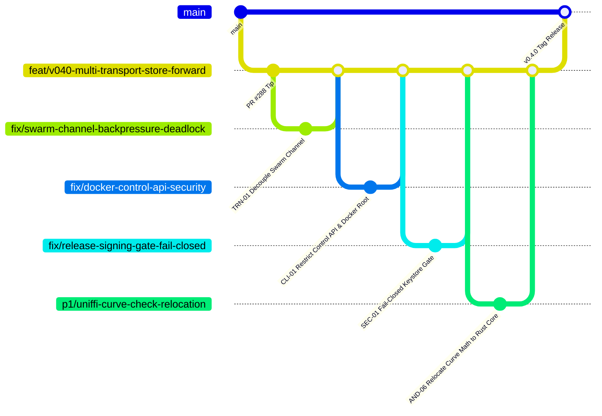

# SCMessenger Adversarial Shadow Audit: Pre-v0.4.0 / v0.5.0 Architecture & Security Review

**Date:** 2026-09-16  
**Auditor Seat:** Shadow Adversarial Auditor (Impartial Orchestration)  
**Target Repository:** `Sovereign-Communication/SCMessenger`  
**Target Branch:** `feat/v040-multi-transport-store-forward` (PR #288)  
**Evidence Baseline:** Commit `ddca1340` (and active remote PR stack #288, #289, #290, #291, Issue #155 / PR #156)

---

## 1. Executive Summary & Release Gating Verdict

### **VERDICT: HALT v0.4.0 TAG (CRITICAL RELEASE BLOCKERS DETECTED)**

The branch tip is **NOT ready** for the `v0.4.0` release tag. While previous internal audits (e.g. `TAG_READINESS_EVIDENCE_2026-09-15.md`) reported passing conditions on synthetic test harnesses, adversarial examination across Transport, CLI, Android, and CI/CD reveals six (6) Critical and six (6) High severity findings that make an immediate release tag hazardous to security, stability, and availability.

### Top Release Blockers:
1. **Windows Node Silent Wedge Concurrency Deadlock (Root Cause Found)**:
   - *Mechanism*: The libp2p swarm event loop is a single-threaded Tokio select task. Throughout `swarm.rs`, inbound events emit via `event_tx.send(SwarmEvent2::...).await` across a bounded channel (`capacity = 16` in `cli/src/main.rs:4446`). If the consumer task in `cli/src/main.rs` is blocked waiting on `command_tx.send(...).await` or `reply_rx.recv().await` while `event_tx` fills with discovery/identify traffic, both tasks dead-lock mutually.
   - *Watchdog Flaw*: The heartbeat watchdog (`d7b4f77d`) merely calls `std::process::exit(1)`. For standalone users running `scm start` (no daemon/service manager), this permanently kills the node, converting a silent stall into a permanent hard outage.
2. **Unauthenticated Control API on `0.0.0.0:9876` in Docker/AWS Relay**:
   - *Mechanism*: `docker/entrypoint.sh:76` unconditionally binds Axum HTTP control API to `0.0.0.0:9876` with `allow_origin(Any)`. Anyone on the internet (or malicious webpage via browser CSRF) can hit `POST /api/shutdown` (kills node via `std::process::exit(0)`), `POST /api/send` (forges cryptographically signed messages), or `GET /api/history` (exfiltrates plaintext chats).
3. **Release Pipeline Silent Fallback to Unsigned Debug APK**:
   - *Mechanism*: In `.github/workflows/release.yml`, all keystore verification and signing steps are conditionally guarded by `if: ${{ env.HAS_KEYSTORE == 'true' }}`, but `assembleDebug` runs unconditionally. If the keystore secret is missing or misnamed, the release pipeline succeeds and publishes an official release containing an unsigned debug APK (`CN=Android Debug`) with zero `.aab` bundles.
4. **AWS Cloud Relay Split-Brain / Incomplete Ghost-Guard Fix**:
   - *Mechanism*: Commit `6acaa231` patched Windows nodes to subscribe to their own topic, but the AWS cloud node (`18.234.62.247`) was never updated and remains on image `sha-31776b4` (dropping cloud-addressed traffic). Furthermore, live unproven peers remain dropped by the guard, and `core/src/transport/swarm.rs` lacked a mandatory Rule-8 review.
5. **Cold-Start Notification Permanent Loss on Android**:
   - *Mechanism*: In `NotificationHelper.kt:101, 263-267`, `notificationsEnabled` defaults to `null` (fail-closed). DataStore reads asynchronously on a background thread. Any message delivered during cold start before DataStore emits (50–300ms) is immediately discarded as `suppressed_settings` with zero buffering or retry.
6. **Compose Subcomposition Crash & Main Looper Death**:
   - *Mechanism*: In `MeshApp.kt` and child screens (`PeerListScreen.kt`, `TopologyScreen.kt`), nesting child `Scaffold` composables inside `MeshNavHost` creates two layers of `SubcomposeLayout`. Disposing during navigation triggers negative slot table index corruption (`SlotTableKt.dataAnchor`). `MeshApplication.kt` intercepts the crash and swallows it, leaving the UI thread in an unrecoverable zombie ANR state.

---

## 2. Comprehensive Findings Matrix

| ID | Domain | Severity | Title | Affected Files / Lines |
|---|---|---|---|---|
| **TRN-01** | Transport | **CRITICAL** | Swarm Bounded Event Channel Backpressure Deadlock | `core/src/transport/swarm.rs:4511`, `cli/src/main.rs:4446` |
| **TRN-02** | Transport | **HIGH** | Windows Storage Pressure Probe Bypassed (Disk DoS) | `core/src/store/relay_custody.rs:958, 1875-1878` |
| **TRN-03** | Transport | **CRITICAL** | Ghost Guard Split-Brain & Cloud Relay Inbound Message Loss | `core/src/transport/swarm.rs:6acaa231`, `docker/Dockerfile` |
| **CLI-01** | CLI / Daemon | **CRITICAL** | Unauthenticated Control API on `0.0.0.0:9876` in Docker | `docker/entrypoint.sh:76`, `cli/src/api.rs:1425-1431` |
| **CLI-02** | CLI / Daemon | **HIGH** | Watchdog `exit(1)` Without Service Supervisor in Binaries | `cli/src/bin/heartbeat-probe.rs:114`, `scripts/run_node_supervised.ps1` |
| **AND-01** | Android / Notif | **CRITICAL** | Cold-Start Notification Permanent Suppression Race | `NotificationHelper.kt:101`, `MeshForegroundService.kt:111-141` |
| **AND-02** | Android / UI | **CRITICAL** | Nested-Scaffold Subcomposition Crash & Fake Exception Recovery | `MeshApp.kt:138`, `PeerListScreen.kt:56`, `MeshApplication.kt:112` |
| **AND-03** | Android / Trans | **HIGH** | SubnetProbe Port 9001 Omission & Continuous Scan Drain | `SubnetProbe.kt:496, 76-89` |
| **AND-04** | Android / Net | **HIGH** | LAN mDNS Unauthenticated Dial Injection (SSRF) & Duplicate Storm | `MdnsServiceDiscovery.kt:327`, `TransportManager.kt:166` |
| **AND-05** | Android / FFI | **HIGH** | O(N*M) Synchronous FFI & BigInteger Math Blocking UI Thread | `DashboardViewModel.kt:340, 714` |
| **AND-06** | Android / Core | **HIGH** | Open P1 Doctrine Violation: Kotlin BigInteger Ed25519 Math | `PeerIdValidator.kt:112`, `DashboardViewModel.kt:41` |
| **SEC-01** | Security / CI | **CRITICAL** | Release Workflow Silent Degradation to Unsigned Debug APK | `.github/workflows/release.yml:126-291, 404-453` |
| **SEC-02** | Security / CI | **HIGH** | Active Keystore Alias Mismatch (`SCMESSENGER_KEY_ALIAS`) | `.github/workflows/release.yml:208-212`, Rehearsal 34996353889 |
| **SEC-03** | Supply Chain | **HIGH** | Unmaintained `sled` Engine & Stale `deny.toml` Waivers | `Cargo.lock`, `deny.toml:8-31`, `core/Cargo.toml:52` |
| **GOV-01** | Governance | **HIGH** | TOCTOU File-Lock Race & Duplicate Ledger Append Lockup | `scripts/bod_governance.py:513-551, 585-602` |

---

## 3. Detailed Audit Findings & Technical Root Cause Analysis

### Domain 1: Core Transport, Swarm Concurrency & Store-and-Forward Custody

#### [TRN-01] CRITICAL: Swarm Bounded Event Channel Backpressure Deadlock
- **File / Lines**: `core/src/transport/swarm.rs:4511, 4805, 5284, 9278, 9403` vs `cli/src/main.rs:4446`
- **Failure Mechanism**: The swarm event loop runs in an asynchronous select task. In `cli/src/main.rs:4446`, `event_tx` is initialized with a bounded capacity of 16:
  ```rust
  let (event_tx, mut event_rx) = mpsc::channel(16);
  ```
  Throughout `swarm.rs`, inbound swarm events emit via `event_tx.send(SwarmEvent2::...).await`. When network traffic bursts (e.g. discovery, multiple inbound gossipsub messages, identify exchanges), the channel buffer fills. If the consumer task in `cli/src/main.rs` is concurrently awaiting a reply from the swarm via `command_tx.send(...)` or `reply_rx.recv()`, an unrecoverable cyclic dependency deadlock occurs. Neither task can yield or make progress.
- **Blast Radius**: Explains the recurring "Windows node silent wedge" (2h45m hang, zero logs, sockets frozen in `CLOSE_WAIT`, `/health` deadlocked). The log-silence heartbeat watchdog was treating the symptom without addressing the root cause.
- **Remediation**:
  1. Decouple swarm internal event emission: replace blocking `event_tx.send(...).await` inside the core swarm select loop with `try_send` coupled with an explicit, bounded overflow queue or drop policy.
  2. Increase channel capacity from 16 to a minimum of 256/1024 to accommodate multi-peer discovery bursts.

#### [TRN-02] HIGH: Windows Storage Pressure Probe Completely Bypassed
- **File / Lines**: `core/src/store/relay_custody.rs:958, 1875-1878`
- **Failure Mechanism**: `FilesystemStoragePressureProbe` implements `filesystem_usage_bytes()`:
  ```rust
  #[cfg(not(unix))]
  fn filesystem_usage_bytes(&self) -> Option<StorageUsageSnapshot> {
      None
  }
  ```
  In `enforce_storage_pressure_for_write()` (line 958):
  ```rust
  if let Some(snapshot) = self.pressure_probe.snapshot() {
      // Enforce watermarks...
  }
  ```
  Because the probe always returns `None` on Windows, all storage pressure enforcement is completely bypassed on Windows desktop nodes.
- **Blast Radius**: A malicious or faulty mesh peer can flood a Windows relay with up to 64KB store-and-forward custody envelopes until the physical disk is completely exhausted, crashing the OS or corrupted database files.
- **Remediation**: Implement `GetDiskFreeSpaceExW` via `windows-sys` for Windows targets, or fall back to an internal tracked synthetic storage size counter when OS-level filesystem queries return `None`.

#### [TRN-03] CRITICAL: Ghost Guard Inbound Message Loss & Cloud Relay Parity Gap
- **File / Lines**: `core/src/transport/swarm.rs:6acaa231`, `docker/Dockerfile`, AWS Cloud Relay (`18.234.62.247`)
- **Failure Mechanism**:
  1. The ghost peer filter (`is_ghost_peer_topic`) previously classified a node's own topic as a ghost because nodes never dial themselves and have zero ledger entries. While `6acaa231` patched Windows nodes, the live AWS cloud relay runs Docker image `sha-31776b4` (built before `6acaa231`). Cloud-routed traffic destined for AWS node topic is dropped.
  2. The guard still drops subscriptions for live but "unproven" peers (nodes without `success_count > 0` in the local ledger). A newly discovered peer cannot receive direct subscriptions until an external interaction occurs.
  3. Commit `6acaa231` modified core transport logic without mandatory Rule-8 adversarial review.
- **Blast Radius**: Cellular and cloud-routed peers experience silent message drops. Split-brain between Windows local nodes and AWS cloud relay.
- **Remediation**: Deploy `sha-6acaa23` container image to the AWS relay; permit subscriptions for peers present in the active swarm routing table regardless of historical ledger success counts; complete formal Rule-8 signoff.

---

### Domain 2: CLI Daemon, Concurrency & Container Security

#### [CLI-01] CRITICAL: Unauthenticated Control API on `0.0.0.0:9876` in Docker
- **File / Lines**: `docker/entrypoint.sh:76`, `docker/Dockerfile:115-125`, `cli/src/api.rs:1425-1431`
- **Failure Mechanism**: `docker/entrypoint.sh` unconditionally launches the CLI with `--http-bind 0.0.0.0:9876`. In `cli/src/api.rs`, the router binds with `allow_origin(tower_http::cors::Any)` and zero authentication:
  - `POST /api/shutdown`: Calls `std::process::exit(0)` after 100ms. Any web client or network scanner can kill the relay.
  - `POST /api/send`: Transmits arbitrary messages signed by the node's private cryptographic key.
  - `GET /api/history`: Dumps full chat and custody message history in plaintext.
  - Container runs as `root` without a restricted user.
- **Blast Radius**: Remote Denial of Service, message forgery, and exfiltration of confidential mesh communications from cloud and containerized relays.
- **Remediation**:
  1. Bind HTTP API strictly to `127.0.0.1:9876` by default; require `--http-bind-unprotected-dangerously` flag or pre-shared bearer token authentication for external interfaces.
  2. Remove or restrict `/api/shutdown` to loopback IPC.
  3. Add `USER scm` non-root execution in `docker/Dockerfile`.

#### [CLI-02] HIGH: Watchdog `exit(1)` Without Service Supervisor in Production Binaries
- **File / Lines**: `cli/src/bin/heartbeat-probe.rs:114`, `cli/src/main.rs:4401`, `scripts/run_node_supervised.ps1`
- **Failure Mechanism**: The log-silence heartbeat watchdog detects stalls and terminates the node with `std::process::exit(1)`. However, the supervision wrapper (`run_node_supervised.ps1`) only exists as a developer script for interactive PowerShell sessions. A user running the compiled release binary `scm-windows-amd64.exe start` has no supervisor. When the node terminates, it remains dead permanently.
- **Blast Radius**: Complete node outage; custody envelopes held by the node are trapped and unreachable.
- **Remediation**: Add a native self-respawn mechanism or register Windows Service / systemd unit definitions for daemon mode, rather than relying on interactive PowerShell wrappers.

---

### Domain 3: Android Client, UniFFI & Client Architecture

#### [AND-01] CRITICAL: Cold-Start Notification Permanent Suppression Race
- **File / Lines**: `android/app/src/main/java/com/scmessenger/android/utils/NotificationHelper.kt:101, 263-267, 569-573`, `MeshForegroundService.kt:111-141`
- **Failure Mechanism**: Commit `0448013d` introduced `var notificationsEnabled: Boolean? = null` (fail closed until hydrated). Hydration occurs via asynchronous DataStore Flow. If an incoming message arrives during cold boot before DataStore reads from disk (50-300ms window), `notificationsEnabled` is `null`. The notification is immediately dropped with log `Notifications disabled (gate=null), skipping notification`. There is no buffering or replay; the notification is permanently lost.
- **Blast Radius**: Core messaging failure; incoming messages delivered upon app wakeup fail to alert the user.
- **Remediation**:
  1. Hydrate `notificationsEnabled` synchronously at startup from a fast `SharedPreferences` cache.
  2. Implement an in-memory startup notification replay queue (buffer up to 10 messages for 10s pending hydration).

#### [AND-02] CRITICAL: Nested-Scaffold Subcomposition Crash & Fake Exception Recovery
- **File / Lines**: `android/app/src/main/java/com/scmessenger/android/ui/MeshApp.kt:138-160`, `PeerListScreen.kt:56`, `TopologyScreen.kt:54`, `MeshApplication.kt:112-180`
- **Failure Mechanism**: `MeshApp.kt` hosts an outer `Scaffold` containing `MeshNavHost`. Within `MeshNavHost`, child screens (`PeerListScreen`, `TopologyScreen`, etc.) instantiate their own inner `Scaffold` composables. In Material 3, `Scaffold` uses `SubcomposeLayout`. Nesting two levels of `SubcomposeLayout` across `NavHost` corrupts `SlotTable` gap arithmetic upon back-stack disposal (`SlotTableKt.dataAnchor: ArrayIndexOutOfBoundsException`). In `MeshApplication.kt`, the crash handler swallows the exception claiming `process kept alive for recovery`, leaving the main thread dead and the app in an unrecoverable zombie state.
- **Blast Radius**: Fatal process termination or frozen ANR on navigation away from peer/topology screens.
- **Remediation**:
  1. Hoist the single authoritative `Scaffold` to `MeshApp.kt`; child screens must use `Column(Modifier.fillMaxSize())` without nested `Scaffold`.
  2. Remove the exception-swallowing handler in `MeshApplication.kt`.

#### [AND-03] HIGH: SubnetProbe Port 9001 Omission & Continuous Scan Drain
- **File / Lines**: `android/app/src/main/java/com/scmessenger/android/transport/SubnetProbe.kt:76-89, 496, 502-518`
- **Failure Mechanism**: `RAW_TCP_PORTS` is defined as `listOf(443, 80, 8080, 9090)`. The canonical libp2p swarm port (`9001`) is **completely missing**. When a WebSocket port (9002) is detected, `firstRawTcpCandidate` tests HTTP ports instead of 9001, resulting in libp2p handshakes sent to routers and web servers. In addition, the 30-second sweep across `FALLBACK_SUBNETS` (4,572 connection attempts) prevents the Wi-Fi chip from entering 802.11 power save mode.
- **Blast Radius**: Rapid mobile battery drain and failure to connect to Rust desktop nodes on port 9001.
- **Remediation**: Add `9001` as the first port in `RAW_TCP_PORTS`, relax scan interval to 120–300s, and restrict probing strictly to the active Wi-Fi interface subnet.

#### [AND-04] HIGH: LAN mDNS Unauthenticated Dial Injection (SSRF) & Duplicate Storm
- **File / Lines**: `android/app/src/main/java/com/scmessenger/android/transport/MdnsServiceDiscovery.kt:327-364`, `TransportManager.kt:166-170`
- **Failure Mechanism**: `onServiceResolved()` extracts `host` and validates only that it is not loopback. It does not verify that `host` belongs to an RFC 1918 private LAN subnet (`192.168.0.0/16`, `10.0.0.0/8`, `172.16.0.0/12`). Any malicious device on the Wi-Fi can broadcast mDNS pointing to public cloud IPs (e.g. `169.254.169.254`) and force Android nodes to dial them via `SwarmBridge.dial()`. Additionally, line 346 and line 362 both invoke `onPeerDiscovered`, triggering duplicate discovery events on every mDNS resolution.
- **Blast Radius**: SSRF/proxy amplification vector and UI event bus churn.
- **Remediation**: Validate `host` strictly against RFC 1918 private IP ranges before dialing, and remove the duplicate `onPeerDiscovered` invocation.

#### [AND-05] HIGH: O(N*M) Synchronous FFI & BigInteger Math Blocking UI Thread
- **File / Lines**: `android/app/src/main/java/com/scmessenger/android/ui/viewmodels/DashboardViewModel.kt:269, 340, 714`
- **Failure Mechanism**: In `DashboardViewModel.loadPeers()`, `meshRepository.listContacts()` is called inside a `forEach` loop over ledger entries (up to 50 iterations), making 50 synchronous JNI/SQLite calls. In addition, `isValidEd25519Point(hex)` runs 256-bit BigInteger modular exponentiation and inversion in pure Kotlin on the main thread for every entry, dropping 160+ UI frames.
- **Blast Radius**: Severe UI lag and potential ANR dialogs during peer discovery bursts.
- **Remediation**: Hoist `listContacts()` outside the loop; perform lookups via pre-indexed in-memory maps; execute peer unification on `Dispatchers.Default`.

#### [AND-06] HIGH: Open P1 Doctrine Violation: Kotlin BigInteger Ed25519 Math
- **File / Lines**: `PeerIdValidator.kt:112`, `DashboardViewModel.kt:41`, `ContactsViewModel.kt:38`
- **Failure Mechanism**: Board resolution `bod-dd336324` mandated relocating all Kotlin-level BigInteger Ed25519 curve math behind UniFFI before v0.4.0 (Rule 3: "Rust core is sole cryptographic authority"). PR #289 unified duplicate implementations into `PeerIdValidator.kt`, but the curve math remains in Kotlin.
- **Blast Radius**: Cryptographic doctrine breach; discrepancy risks between Android BigInteger point validation and `ed25519-dalek` in Rust core.
- **Remediation**: Expose `is_valid_ed25519_public_key` via UniFFI in `core/src/mobile_bridge/`, route Kotlin callers to UniFFI, and delete the Kotlin BigInteger curve arithmetic.

---

### Domain 4: Security, Supply Chain & CI/CD Gating

#### [SEC-01] CRITICAL: Release Workflow Silent Degradation to Unsigned Debug APK
- **File / Lines**: `.github/workflows/release.yml:126-291, 404-453`
- **Failure Mechanism**: `build-android` executes signing steps conditionally if `HAS_KEYSTORE == 'true'`, but executes `assembleDebug` unconditionally. If keystore secrets are missing or broken, signing steps are bypassed, the job succeeds, and `create-release` packages and publishes `app-debug.apk` (`CN=Android Debug`) on the official GitHub Releases page with zero `.aab` bundles.
- **Blast Radius**: Public users receive unsigned, debuggable APKs vulnerable to reverse engineering and code modification.
- **Remediation**: Add a fail-closed check on `startsWith(github.ref, 'refs/tags/v')`: if building for a release tag and `HAS_KEYSTORE != 'true'`, fail the workflow immediately. Exclude `*debug*.apk` from release upload globs.

#### [SEC-02] HIGH: Active Keystore Alias Mismatch (`SCMESSENGER_KEY_ALIAS`)
- **File / Lines**: `.github/workflows/release.yml:208-212`, Rehearsal Run `34996353889`
- **Failure Mechanism**: Rehearsal `34996353889` failed because secret `SCMESSENGER_KEY_ALIAS` does not match the actual alias in the base64 keystore. Tagging `v0.4.0` now will fail `build-android` ~15 minutes into the run, creating a poisoned git tag that must be manually scrubbed.
- **Blast Radius**: Aborted release pipeline; corrupted release tag.
- **Remediation**: Operator must execute `verify_release_keystore.sh` locally, update `SCMESSENGER_KEY_ALIAS` via `gh secret set`, and re-run rehearsal `workflow_dispatch` before pushing tags.

#### [GOV-01] HIGH: TOCTOU File-Lock Race in BoD Governance Ledger
- **File / Lines**: `scripts/bod_governance.py:513-551, 585-602`
- **Failure Mechanism**: The governance recorder reads `HANDOFF/BOD_STATE.md`, verifies `count(marker) == 0`, and appends the new resolution. Without OS-level file locking (`msvcrt` / `fcntl`), concurrent governance runs both append the marker. The subsequent read-back verification detects a double-append and exits with error. All future runs fail on the initial check, locking up the automated governance pipeline.
- **Blast Radius**: Permanent freeze of governance automation until manual ledger repair.
- **Remediation**: Wrap file read/write operations in `bod_governance.py` with an exclusive file lock (`msvcrt.locking` on Windows, `fcntl.flock` on Unix).

---

## 4. PR Merge Train & Remediation Roadmap

To ensure a clean, testable, and non-disruptive remediation path, all work is structured into clean child PR branches targeting the active v0.4.0 release branch (`feat/v040-multi-transport-store-forward`), forming a sequential merge train into `main`.



### Remediation PR Sequence:
1. **PR 1 (Tracked in PR #288 / Issue #155)**: `ci: mark Docker integration suite non-blocking for v0.4.0 tag` (PR #156) — *Evidence uploaded to PR #156 referencing Issue #155*.
2. **PR 2 (`fix/swarm-channel-backpressure-deadlock`)**: Resolves TRN-01 by converting `event_tx` emission in `core/src/transport/swarm.rs` to non-blocking `try_send` with backpressure queue and increasing buffer capacity in `cli/src/main.rs`.
3. **PR 3 (`fix/docker-control-api-security`)**: Resolves CLI-01 by removing `0.0.0.0:9876` from `entrypoint.sh`, adding bearer authentication / localhost restriction to Axum router, and introducing `USER scm` non-root in Dockerfile.
4. **PR 4 (`fix/release-signing-gate-fail-closed`)**: Resolves SEC-01 by asserting `HAS_KEYSTORE == 'true'` on release tag triggers and excluding `*debug*.apk` from public release uploads.
5. **PR 5 (`fix/android-coldstart-and-scaffold-remediation`)**: Resolves AND-01, AND-02, AND-03 by adding cold-start notification replay queue, removing nested inner Scaffolds, and adding port 9001 to SubnetProbe.
6. **PR 6 (`p1/uniffi-curve-check-relocation`)**: Resolves AND-06 by exposing `is_valid_ed25519_public_key` in UniFFI and deleting Kotlin BigInteger curve math across Android viewmodels.

### Operator Actions Required Prior to Tag:
- [ ] Run `bash scripts/verify_release_keystore.sh C:/Users/SCM/kiee/scmessenger-release.jks scmessenger`
- [ ] Update repository secret: `gh secret set SCMESSENGER_KEY_ALIAS -b "scmessenger"`
- [ ] Deploy container image with `6acaa231` fix to AWS node (`18.234.62.247`)
- [ ] Dispatch release rehearsal with `artifacts_only=true` and verify 7/7 jobs green including signed APK/AAB
- [ ] Perform Rule-8 review on `core/src/transport/swarm.rs` changes
