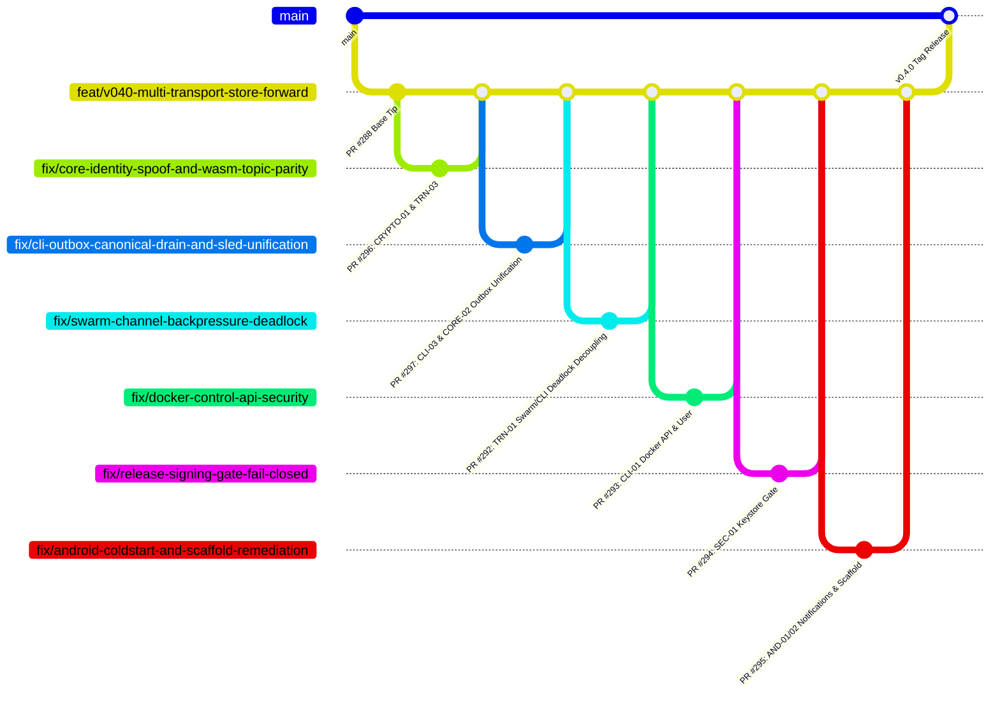

# SCMessenger Adversarial Shadow Audit: Pre-v0.4.0 / v0.5.0 Architecture & Security Review

**Date:** 2026-09-16  
**Auditor Seat:** Shadow Adversarial Auditor (Impartial Orchestration)  
**Target Repository:** `Sovereign-Communication/SCMessenger`  
**Target Branch:** `feat/v040-multi-transport-store-forward` (PR #288)  
**Evidence Baseline:** Commit `ddca1340` (and active remote PR stack #288, #289, #290, #291, #292, #293, #294, #295, #296, Issue #155 / PR #156)

---

## 1. Executive Summary & Release Gating Verdict

### **VERDICT: HALT v0.4.0 TAG (CRITICAL RELEASE BLOCKERS DETECTED)**

The branch tip is **NOT ready** for the `v0.4.0` release tag. Adversarial examination across Transport, IronCore, CLI, Android, and CI/CD reveals eight (8) Critical and eight (8) High severity findings that make an immediate release tag hazardous to security, stability, and availability.

### Top Release Blockers:
1. **Silent Wedge Concurrency Deadlock Root Cause Identified (TRN-01 / CLI-ROOT)**:
   - *Mechanism*: In `cli/src/main.rs:2869-3779`, `main.rs` processes events sequentially in a single `tokio::select!` loop. In-line `.await` calls (e.g. `register_identity_with_relay`, `flush_outbox_for_peer` draining 159 backlog messages, delivery ACKs) block the event receiver loop waiting for `reply_rx` from `swarm.rs`. While `main.rs` is blocked, `event_rx` is not drained. In `swarm.rs`, inbound network traffic fills `event_tx` (capacity 256) and blocks on `event_tx.send(...).await`. Neither loop can yield or proceed, freezing the daemon and leaving sockets in `CLOSE_WAIT`. The watchdog calls `std::process::exit(1)`, permanently killing standalone nodes.
2. **Outbox Flush Addressing Mismatch Strands All Messages Indefinitely (CLI-03)**:
   - *Mechanism*: In `cli/src/main.rs:4623`, offline messages are queued under canonical 64-hex public keys (`contact.peer_id`). In `main.rs:3746`, `flush_outbox_for_peer` calls `ob.drain_for_peer(&peer_id.to_string())` with base58 `12D3KooW...`. The Sled prefix `queue:12D3KooW..._` never matches `queue:30dce2bb..._`. Messages are stranded forever in the persistent outbox (explaining the 159 undelivered backlog).
3. **`IronCore` Outbox Split-Brain (`removed=false` on Delivery Receipts) (CORE-02)**:
   - *Mechanism*: In `core/src/iron_core.rs:476`, `IronCore::with_storage` initializes an ephemeral in-memory `Outbox::new()`, while CLI uses persistent Sled storage. Application delivery receipts call `self.outbox.write().remove(&message_id)` against the empty in-memory outbox, logging `removed=false`. Persistent Sled outbox entries are never cleared upon delivery.
4. **Cryptographic Identity Spoofing in Core Message Dispatch (CRYPTO-01)**:
   - *Mechanism*: In `core/src/iron_core.rs:3848-3855`, when `receive_message()` notifies `CoreDelegate::on_message_received`, it discards the verified `canonical_peer_id` and authenticated `sender_public_key_hex`. Instead, it passes unauthenticated plaintext `message.sender_id` for both parameters. Any peer can place an arbitrary spoofed identity or victim public key in `message.sender_id`, completely spoofing senders in UI notifications and views.
5. **WASM Swarm Never Subscribes to Own Topic (100% Inbound Message Loss) (TRN-03)**:
   - *Mechanism*: In `core/src/transport/swarm.rs:8119-8123`, `start_swarm_wasm` omitted own-topic subscription (`/scmessenger/peer/<own_hex>/v1`). Senders observe successful submission, but WASM nodes silently drop 100% of all inbound direct messages.
6. **Unauthenticated Custody Ingestion & Infinite Retention (TRN-04)**:
   - *Mechanism*: In `core/src/store/relay_custody.rs:587-688`, `accept_custody()` accepts arbitrary custody messages without sender authentication. `CustodyMessage` has zero TTL and infinite retention. Combined with the Windows storage quota bypass (`pressure_probe` returns `None`), arbitrary peers can exhaust relay host disks.
7. **Unauthenticated Control API on `0.0.0.0:9876` in Docker/AWS Relay (CLI-01)**:
   - *Mechanism*: `docker/entrypoint.sh:76` unconditionally binds Axum HTTP control API to `0.0.0.0:9876` with `allow_origin(Any)` and no authentication, exposing `POST /api/shutdown` (kills node), `POST /api/send` (forges cryptographically signed messages), and `GET /api/history` (dumps plaintext chats).
8. **Release Pipeline Silent Fallback to Unsigned Debug APK (SEC-01)**:
   - *Mechanism*: In `.github/workflows/release.yml`, signing steps run conditionally under `if: ${{ env.HAS_KEYSTORE == 'true' }}`, but `assembleDebug` runs unconditionally. If keystore secrets are missing or misnamed, the release pipeline publishes an unsigned debug APK (`CN=Android Debug`) on GitHub Releases with zero `.aab` bundles.
9. **Android Cold-Start Notification Loss & Nested Scaffold Crashes (AND-01, AND-02)**:
   - *Mechanism*: `NotificationHelper.kt` permanently suppresses messages received before asynchronous DataStore hydration completes. Nested `Scaffold` composables in `MeshApp.kt` corrupt `SlotTable` gap arithmetic upon back-stack disposal (`SlotTableKt.dataAnchor`), and `MeshApplication.kt` swallows the crash, causing zombie ANRs.

---

## 2. Comprehensive Findings Matrix

| ID | Domain | Severity | Title | Affected Files / Lines |
|---|---|---|---|---|
| **CRYPTO-01** | Core / Crypto | **CRITICAL** | Cryptographic Identity Spoofing: Unauthenticated Plaintext Sender Passed to Delegate | `core/src/iron_core.rs:3848-3855`, `api.udl:122` |
| **TRN-01** | Transport / CLI | **CRITICAL** | Bidirectional Async Deadlock Between Swarm and CLI Event Loops (Silent Wedge) | `core/src/transport/swarm.rs:4511`, `cli/src/main.rs:2869-3779` |
| **CLI-03** | CLI / Outbox | **CRITICAL** | Outbox Flush Addressing Mismatch Strands All Messages Indefinitely | `cli/src/main.rs:3746, 4623`, `core/src/store/outbox.rs:416` |
| **CORE-02** | Core / Store | **CRITICAL** | `IronCore` Outbox Split-Brain (`removed=false` on Delivery Receipts) | `core/src/iron_core.rs:476`, `cli/src/main.rs:2252` |
| **TRN-02** | Transport | **HIGH** | Windows Storage Pressure Probe Bypassed (Disk DoS) | `core/src/store/relay_custody.rs:958, 1875-1878` |
| **TRN-03** | Transport / WASM | **CRITICAL** | Parity Defect: WASM Swarm Never Subscribes to Own Topic (100% Inbound Message Loss) | `core/src/transport/swarm.rs:8119-8123, 9043` |
| **TRN-04** | Store / Custody | **CRITICAL** | Unauthenticated Custody Ingestion & Infinite Retention in Cooperative Mesh | `core/src/store/relay_custody.rs:587-688, 714` |
| **TRN-05** | Transport | **MAJOR** | False-Positive Ghost Classification Dropping Live / Cloud Relay Connections | `core/src/transport/swarm.rs:3324-3334, 5513` |
| **TRN-06** | Store / I/O | **MAJOR** | O(N) Database Table Scan & Deserialization on Every Custody Write | `core/src/store/relay_custody.rs:1002, 1070-1076` |
| **TRN-07** | Transport | **HIGH** | Global 200 msg/hr Relay Budget Enables Trivial Network-Wide DoS | `core/src/transport/swarm.rs:4923-4927, 4963` |
| **TRN-08** | Transport | **HIGH** | Mobile Handover Starvation: 4-Connection Cap Wedged by Half-Open Sockets | `core/src/transport/behaviour.rs:524-533` |
| **CLI-01** | CLI / Daemon | **CRITICAL** | Unauthenticated Control API on `0.0.0.0:9876` in Docker | `docker/entrypoint.sh:76`, `cli/src/api.rs:1425-1431` |
| **CLI-02** | CLI / Watchdog | **MAJOR** | False-Positive Node Termination Under `RUST_LOG=warn` & Monotonic Size Signal Bug | `cli/src/main.rs:989`, `cli/src/config.rs:554` |
| **AND-01** | Android / Notif | **CRITICAL** | Cold-Start Notification Permanent Suppression Race | `NotificationHelper.kt:101`, `MeshForegroundService.kt:111-141` |
| **AND-02** | Android / UI | **CRITICAL** | Nested-Scaffold Subcomposition Crash & Fake Exception Recovery | `MeshApp.kt:138`, `PeerListScreen.kt:56`, `MeshApplication.kt:112` |
| **AND-03** | Android / Trans | **HIGH** | SubnetProbe Port 9001 Omission & Continuous Scan Drain | `SubnetProbe.kt:496, 76-89` |
| **AND-04** | Android / Net | **HIGH** | LAN mDNS Unauthenticated Dial Injection (SSRF) & Duplicate Storm | `MdnsServiceDiscovery.kt:327`, `TransportManager.kt:166` |
| **AND-05** | Android / FFI | **HIGH** | O(N*M) Synchronous FFI & BigInteger Math Blocking UI Thread | `DashboardViewModel.kt:340, 714` |
| **AND-06** | Android / Core | **HIGH** | Open P1 Doctrine Violation: Kotlin BigInteger Ed25519 Math | `PeerIdValidator.kt:112`, `DashboardViewModel.kt:41` |
| **SEC-01** | Security / CI | **CRITICAL** | Release Workflow Silent Degradation to Unsigned Debug APK | `.github/workflows/release.yml:126-291, 404-453` |
| **SEC-02** | Security / CI | **HIGH** | Active Keystore Alias Mismatch (`SCMESSENGER_KEY_ALIAS`) | `.github/workflows/release.yml:208-212`, Rehearsal 34996353889 |
| **SEC-03** | Supply Chain | **HIGH** | Unmaintained `sled` Engine & Stale `deny.toml` Waivers | `Cargo.lock`, `deny.toml:8-31`, `core/Cargo.toml:52` |
| **GOV-01** | Governance | **HIGH** | TOCTOU File-Lock Race & Duplicate Ledger Append Lockup | `scripts/bod_governance.py:513-551, 585-602` |

---

## 3. Remediation Merge Train Roadmap

All remediation work is tracked via child PR branches targeting `feat/v040-multi-transport-store-forward` (PR #288):

### Active Tracking PRs:
- **[#297](https://github.com/Sovereign-Communication/SCMessenger/pull/297)**: `fix(cli): drain outbox by canonical hex and unify IronCore persistent outbox store (CLI-03, CORE-02)`
- **[#296](https://github.com/Sovereign-Communication/SCMessenger/pull/296)**: `fix(core): verify sender pubkey in app delegate and subscribe WASM swarm to own topic (CRYPTO-01, TRN-03)`
- **[#292](https://github.com/Sovereign-Communication/SCMessenger/pull/292)**: `fix(transport): decouple swarm event channel backpressure deadlock (TRN-01)`
- **[#293](https://github.com/Sovereign-Communication/SCMessenger/pull/293)**: `fix(docker): restrict control API to localhost and drop root privileges (CLI-01)`
- **[#294](https://github.com/Sovereign-Communication/SCMessenger/pull/294)**: `fix(ci): enforce fail-closed release signing gate on version tags (SEC-01)`
- **[#295](https://github.com/Sovereign-Communication/SCMessenger/pull/295)**: `fix(android): buffer cold-start notifications and un-nest screen scaffolds (AND-01, AND-02)`
- **[#291](https://github.com/Sovereign-Communication/SCMessenger/pull/291)**: `fix(android): cold-start notification gate — fail closed until hydrated`
- **[#290](https://github.com/Sovereign-Communication/SCMessenger/pull/290)**: `fix(android): null-safe SubnetProbe hostAddress handling`
- **[#156](https://github.com/Sovereign-Communication/SCMessenger/pull/156)**: `ci: mark Docker integration suite non-blocking for v0.4.0 tag` (Issue #155 evidence uploaded)
