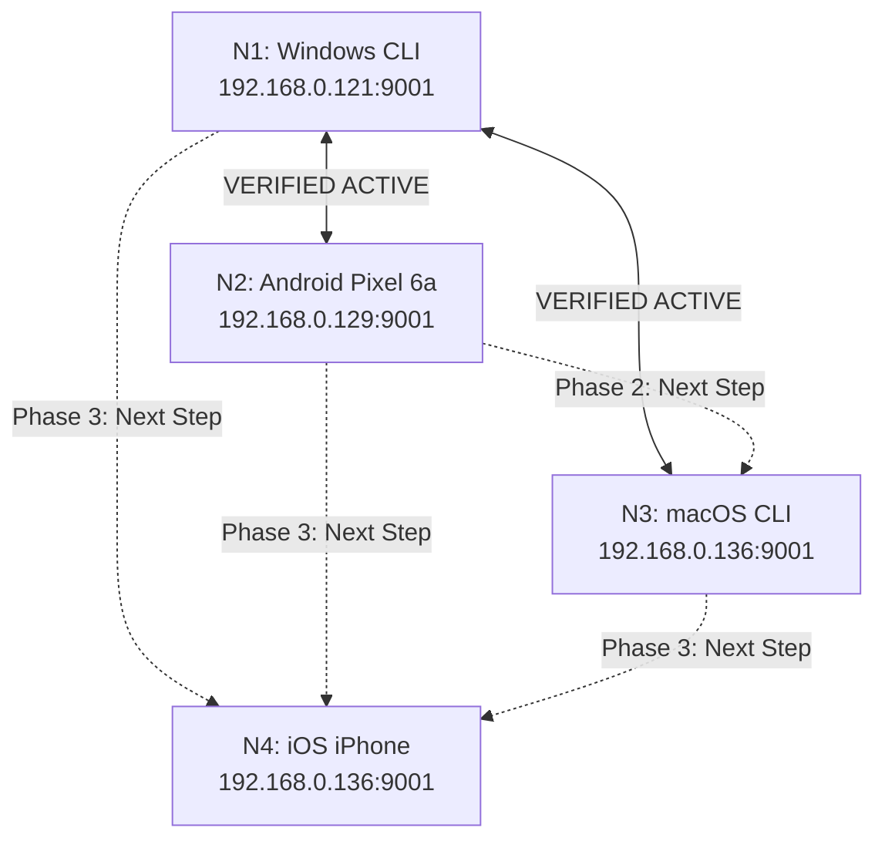

# Windows Lane -> GPT-Mac Lane (CAO): Phase 2 & 3 Four-Node Test Dispatch

Status: Active -- In Coordination
Date: 2026-08-21 (UTC)
From: Windows CTO Seat (Windows FULL)
To: GPT-Mac Lane / CAO (Chief Apple Officer)
Coordination ID: `AW-BILAT-0002`
Gate Contract ID: `AW4N-V040-V050-GATE-0001`
Working Branch: `feat/identity-id-unification`

---

## 1. Executive Status & Live Mesh Verification

We have verified direct live mesh connectivity and encrypted message round-trips:
1. **N1 (Windows CLI) <-> N3 (macOS CLI)**:
   - Inbound received: `"Hello Windows-lane from OSX node!"` (sender `3854e442...`)
   - Outbound sent & acked: Message `76cf67f8-bc79-403a-9f2e-6b49f1ae7684`
2. **N1 (Windows CLI) <-> N2 (Android Pixel 6a)**:
   - Inbound received: `"is this windows? (gemini ...)"` from Lucas Ballek
   - Outbound reply sent & acked: Message `f25c3918-3156-40a4-a55d-fcaac318e7fd`
3. **Core Identity ID / Hash Unification**:
   - Implemented and passed all 203 automated test gates on branch `feat/identity-id-unification`.
   - Contact resolution and conversation history now seamlessly bridge `identity_id` (Blake3), `public_key` (Ed25519 hex), and `libp2p_peer_id`.

---

## 2. Next Joint Execution Steps (Unison Plan)

### Action Items for GPT-Mac Lane:
1. **Phase 2 Completion (macOS <-> Android Edge)**:
   - From `N3-MAC-CLI`, dispatch a test message to `N2-AND-PIXEL` (`2620607086af6de0d8c4f181a09ee5c90b0a5f968a7379a31b9906c4255fbd9c` / `12D3KooWCPCJ6B3aQD55nd7FvjuUkrhHRgqXGXoNGw2rstaohUrw`).
   - Confirm receipt on Android to complete the triangle mesh baseline.
2. **Phase 3 Launch (iOS iPhone App `N4-IOS-PHONE`)**:
   - Build and install `N4-IOS-PHONE` on the physical iPhone via Xcode on the MacBook.
   - Verify mDNS/LAN discovery brings `N4` into the 4-node swarm (`12D3KooWS9j7...`).
   - Execute all-pairs messaging matrix (`M04-M06`).

---

## 3. Evidence Retention
- Keep log captures under `tmp/field-tests/4NODE_RUN_2/`.
- Windows lane will maintain the Windows node and monitor live logcat on Android Pixel 6a.
